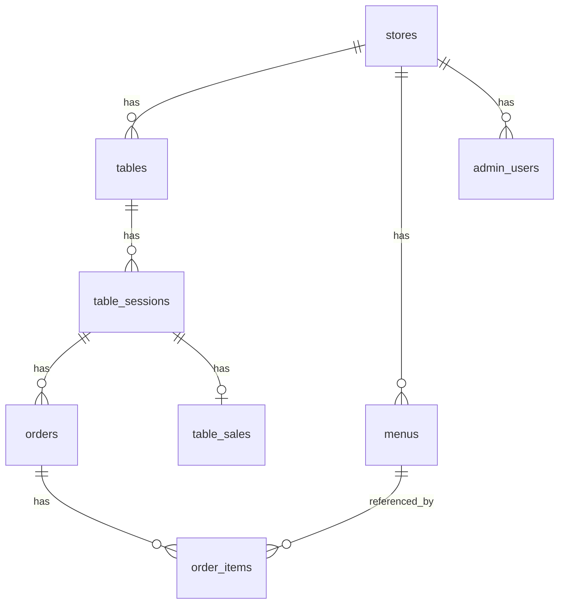

# Database Design

## 概要

本システムでは、注文・メニュー・テーブル利用・売上などの業務データをMySQLで管理する。

RAGで使用するベクトルデータはPostgreSQL + pgvectorで管理する。

## ER図

## テーブル定義

### stores

店舗情報を管理する。

| カラム | 型 | NULL | 説明 |
| --- | --- | --- | --- |
| id | BIGINT | NO | 店舗ID |
| name | VARCHAR(255) | NO | 店舗名 |
| created_at | DATETIME | NO | 作成日時 |
| updated_at | DATETIME | NO | 更新日時 |

---

### tables

店舗内のテーブルを管理する。

| カラム | 型 | NULL | 説明 |
| --- | --- | --- | --- |
| id | BIGINT | NO | テーブルID |
| store_id | BIGINT | NO | 店舗ID |
| table_number | INT | NO | 店舗内のテーブル番号 |
| created_at | DATETIME | NO | 作成日時 |
| updated_at | DATETIME | NO | 更新日時 |

### Foreign Key

- store_id -> stores.id

---

### table_sessions

1組の客によるテーブル利用を管理する。

| カラム | 型 | NULL | 説明 |
| --- | --- | --- | --- |
| id | BIGINT | NO | テーブル利用セッションID |
| table_id | BIGINT | NO | テーブルID |
| guest_no | INT | NO | 客番号 |
| status | VARCHAR | NO | 利用状態 |
| started_at | DATETIME | NO | 利用開始日時 |
| closed_at | DATETIME | NO | 利用終了日時 |
| created_at | DATETIME | NO | 作成日時 |
| updated_at | DATETIME | NO | 更新日時 |

### Foreign Key

- table_id -> tables.id

---

### menus

店舗のメニューを管理する。

| カラム | 型 | NULL | 説明 |
| --- | --- | --- | --- |
| id | BIGINT | NO | メニューID |
| store_id | BIGINT | NO | 店舗ID |
| name | VARCHAR | NO | メニュー名 |
| price | INT | NO | 販売価格 |
| description | TEXT | YES | メニュー説明 |
| image_url | VARCHAR | YES | メニュー画像URL |
| is_available | BOOLEAN | NO | 注文可能か |
| created_at | DATETIME | NO | 作成日時 |
| updated_at | DATETIME | NO | 更新日時 |

### Foreign Key

- store_id -> stores.id

### orders

1回の注文操作を管理する。

同じテーブル利用セッション内でも、追加注文された場合は別の注文として登録する。

| カラム | 型 | NULL | 説明 |
| --- | --- | --- | --- |
| id | BIGINT | NO | 注文ID |
| table_session_id | BIGINT | NO | テーブル利用セッションID |
| created_at | DATETIME | NO | 作成日時 |
| updated_at | DATETIME | NO | 更新日時 |

### Foreign Key

- table_session_id -> table_sessions.id

### order_items

注文に含まれる商品を管理する。

| カラム | 型 | NULL | 説明 |
| --- | --- | --- | --- |
| id | BIGINT | NO | 注文明細ID |
| order_id | BIGINT | NO | 注文ID |
| menu_id | BIGINT | NO | メニューID |
| quantity | INT | NO | 注文数量 |
| unit_price | INT | NO | 注文時点の商品単価 |
| status | VARCHAR | NO | 提供状態 |
| created_at | DATETIME | NO | 作成日時 |
| updated_at | DATETIME | NO | 更新日時 |

### Foreign Key

- order_id -> orders.id
- menu_id -> menus.id

### table_sales

1回のテーブル利用セッションに対する売上を管理する。

実際の決済情報は管理せず、会計完了時点の売上金額を保存する。

| カラム | 型 | NULL | 説明 |
| --- | --- | --- | --- |
| id | BIGINT | NO | 売上ID |
| table_session_id | BIGINT | NO | テーブル利用セッションID |
| total_amount | INT | NO | 売上合計金額 |
| created_at | DATETIME | NO | 作成日時 |

### Foreign Key

- table_session_id -> table_sessions.id

### admin_users

店舗管理画面へログインするユーザーを管理する。

| カラム | 型 | NULL | 説明 |
| --- | --- | --- | --- |
| id | BIGINT | NO | 管理ユーザーID |
| store_id | BIGINT | NO | 店舗ID |
| email | VARCHAR | NO | ログイン用メールアドレス |
| password_hash | VARCHAR | NO | ハッシュ化したパスワード |
| created_at | DATETIME | NO | 作成日時 |
| updated_at | DATETIME | NO | 更新日時 |

### Foreign Key

- store_id -> stores.id

## 設計方針

- カート情報はDBには保存せず、フロントエンド側で保持する
- 注文時点の商品価格を order_items.unit_price に保存する
- 提供状態は注文単位ではなく注文明細単位で管理する
- 会計完了時に table_sales を作成し、table_sessions.status を CLOSED に変更する
